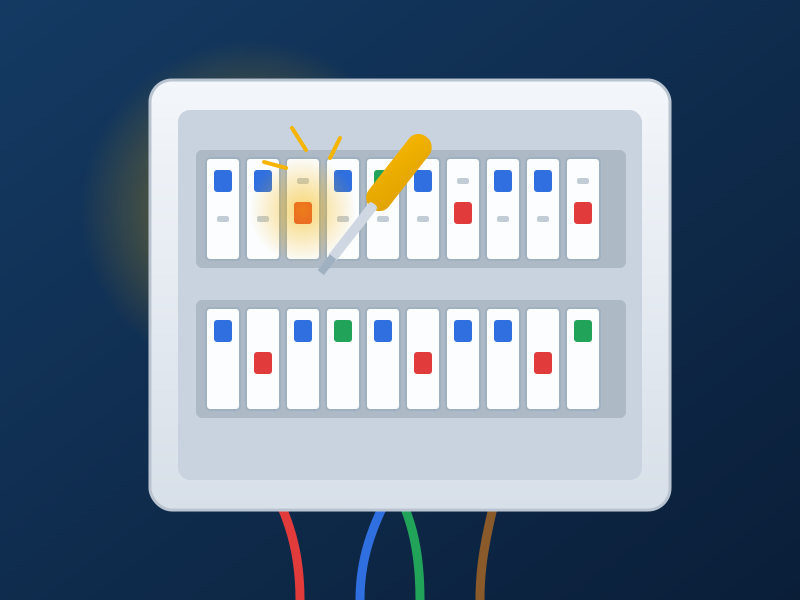

# ELEC PRO — Landing de instalaciones eléctricas

Recreación fiel (diseño **y** funcionalidad) de la landing **ELEC PRO**:
boletines eléctricos, urgencias 24h, instalaciones, cuadros y altas de luz en
Barcelona. Construida con **HTML semántico + SCSS (arquitectura 7‑1) + JavaScript
vanilla (ES Modules)**. Sin frameworks ni librerías de UI.



---

## 🚀 Cómo levantar el proyecto

Requisitos: **Node.js 18+**.

```bash
# 1) Instalar dependencias de build (sass, serve, concurrently)
npm install

# 2a) Desarrollo: compila SCSS en watch + servidor local en http://localhost:3000
npm run dev

# 2b) Solo servidor estático (el CSS ya viene compilado en dist/)
npm run serve
```

> El CSS compilado (`dist/css/main.css`) **ya está incluido**, así que el sitio
> funciona aunque no recompiles. Si tocas el SCSS, usa `npm run dev` o:

```bash
npm run build       # genera dist/css/main.css minificado (producción)
npm run watch:css   # recompila al guardar, con sourcemaps (desarrollo)
```

> ⚠️ Ábrelo **a través del servidor** (`localhost:3000`), no con `file://`:
> el JS usa ES Modules y el navegador los bloquea bajo `file://`.

---

## 🗂️ Estructura

```
elecPro/
├── index.html                 # Marca semántica + sprite SVG de iconos
├── assets/img/                # Ilustraciones SVG propias (sin fotos externas)
│   ├── hero-panel.svg         # Cuadro eléctrico ilustrado del hero
│   └── favicon.svg
├── dist/css/main.css          # CSS compilado (no editar a mano)
└── src/
    ├── scss/                  # Arquitectura 7‑1
    │   ├── abstracts/         # variables, funciones, mixins (+ _index barrel)
    │   ├── base/              # reset, tokens (:root), tipografía, globales, a11y
    │   ├── layout/            # header (con drawer móvil), footer
    │   ├── components/        # button, badge, hero, service-card, feature,
    │   │                      #   cta-band, review-card, form, floating, toast…
    │   ├── pages/             # _home (layout de secciones)
    │   └── main.scss          # Punto de entrada (@use de todo)
    └── js/
        ├── main.js            # Arranque: inicializa los módulos
        ├── data/reviews.js    # Mock de opiniones extra ("Ver más")
        └── modules/           # nav, theme, scrollspy, reveal, reviews, form,
                               #   floating, toast
```

### Sistema de diseño (tokens)
Todos los valores viven en **CSS custom properties** (`src/scss/base/_root.scss`)
o en **variables SCSS** cuando hacen falta en tiempo de compilación
(breakpoints, z‑index → `src/scss/abstracts/_variables.scss`). **No hay valores
mágicos hardcodeados** en componentes.

| Token        | Valor |
|--------------|-------|
| Navy         | `#0c2545` / `#0a1e38` |
| Amarillo     | `#f5b400` (hover `#e0a300`) |
| Fondo / surface | `#f4f5f7` / `#ffffff` |
| Texto        | `#16243b` / `#4b5563` |
| Tipografía   | Poppins (titulares) · Inter (cuerpo) |
| Breakpoints  | 480 · 768 · 1024 · 1280 px |
| Radios       | 6 · 10 · 16 · pill |

---

## ✅ Funcionalidad implementada

- **Header sticky** con sombra al hacer scroll.
- **Menú hamburguesa** accesible (drawer + backdrop, bloqueo de scroll, cierre
  con `Esc`/click fuera/al navegar, *focus trap* y retorno de foco).
- **Scrollspy**: resalta el enlace de la sección visible (`IntersectionObserver`).
- **Smooth‑scroll** con compensación del header (`scroll-padding-top`).
- **Reveal on scroll** con *stagger*, respetando `prefers-reduced-motion`.
- **Carrusel de opiniones** en móvil (scroll‑snap + *dots* sincronizados) y
  botón **“Ver más opiniones”** que carga datos mock.
- **Formulario de presupuesto** con validación en vivo (nombre, teléfono español,
  email, servicio, consentimiento), errores accesibles (`aria-live`,
  `aria-invalid`), estado *loading* y **toast** de éxito.
- **Modo oscuro** con toggle persistente (`localStorage`) y sin *flash* (se aplica
  antes del primer pintado).
- **Botón flotante de WhatsApp** (con pulso) y **volver arriba**.
- Enlaces `tel:` y `wa.me` reales; foco visible en todo lo interactivo.

---

## 🧩 Supuestos asumidos

- Se tomó como diseño canónico la **variante navy + amarillo** (la más completa:
  incluye “por qué elegirnos”, formulario y footer). Se integraron elementos de
  la variante clara (tira de confianza bajo los servicios) y la primera imagen
  (LF) se usó solo como referencia de estilo.
- **Datos de contacto de ejemplo**: teléfono `600 123 456`, email
  `info@elecpro.com`, instalador `BA‑12345`, zona “Barcelona y alrededores”.
  Cámbialos en `index.html` (y en los enlaces `tel:`/`wa.me`).
- El **envío del formulario está simulado** (`setTimeout`). Para producción,
  sustituye el bloque marcado en `src/js/modules/form.js` por un `fetch` a tu
  backend / servicio (Formspree, etc.).
- En lugar de fotografías de stock se crearon **ilustraciones SVG propias**
  (cuadro eléctrico) para que el proyecto sea autónomo, ligero y sin peticiones
  externas. Sustituye `assets/img/hero-panel.svg` por tu foto si lo prefieres.
- Opiniones y rating son **mock realistas**.

---

## ✨ Mejoras añadidas (libertad creativa)

1. **Modo oscuro** completo con toggle accesible y persistencia.
2. **Datos estructurados** `schema.org/Electrician` (SEO local) + Open Graph.
3. **Accesibilidad**: skip‑link, `aria-current`, roles, `aria-live` en errores y
   toasts, focus visible, *focus trap* en el drawer, `prefers-reduced-motion`.
4. **Rendimiento**: 0 dependencias en runtime, iconos en **sprite SVG** + iconos
   inline como *data‑URI*, tipografías con `display=swap`, imágenes con
   `width/height` (evita CLS), animaciones GPU‑friendly.
5. **Progressive enhancement**: las animaciones `reveal` se activan solo si hay
   JS (`.js`), así sin JavaScript todo el contenido sigue visible.
6. **Microinteracciones**: hover de tarjetas con barra superior y flecha,
   pulso del FAB, transiciones coherentes con los tokens.
7. **Carrusel táctil** de opiniones con *scroll‑snap* nativo y *dots*.

---

## 🛠️ Personalización rápida

| Quiero cambiar… | Dónde |
|---|---|
| Colores, espaciados, tipografías | `src/scss/base/_root.scss` |
| Breakpoints / z‑index | `src/scss/abstracts/_variables.scss` |
| Textos, servicios, opiniones | `index.html` |
| Teléfono / WhatsApp / email | `index.html` (`tel:`, `wa.me`, `mailto:`) |
| Lógica de envío del formulario | `src/js/modules/form.js` |

## Licencia
MIT.
